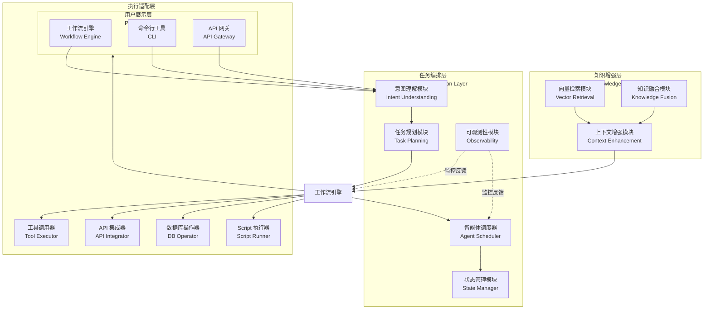
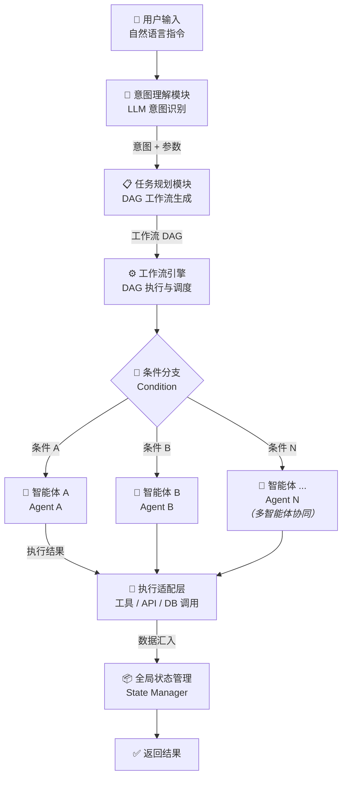

# 架构文档

> 本文档详细描述 KNOT 系统的整体架构设计与各模块职责。

## 一、架构总览

KNOT 采用"**用户展示层 + 知识增强层 + 任务编排层 + 执行适配层**"四层解耦架构：

### 各层职责

| 层次 | 职责 | 核心能力 |
|------|------|----------|
| **用户展示层** | 提供可视化工作流编辑器、CLI 与 API 网关，是用户与系统交互的入口 | 拖拽式编排、实时预览、可视化监控 |
| **知识增强层** | 外部知识库语义化检索与融合，为 LLM 生成提供实时精准的上下文支撑 | RAG、向量检索、混合检索、动态注入 |
| **任务编排层** | 系统核心中枢，将自然语言指令拆解为可执行子任务序列，驱动智能体协同 | 意图识别、DAG 规划、多智能体调度、状态管理 |
| **执行适配层** | 对接各类工具和外部服务，将原子指令转化为具体操作 | 工具调用、API 集成、数据库操作、第三方连接 |

## 二、用户展示层（Presentation Layer）

### 职责
提供用户与系统交互的入口，包括可视化工作流编辑器、CLI 工具和 API 网关三个接入方式，满足不同技术背景用户的操作需求。

### 核心组件

| 组件 | 职责 |
|------|------|
| 可视化工作流编辑器 | 图形化拖拽式编排界面，支持工作流设计、实时预览与运行监控 |
| 命令行工具 | 提供脚本化操作入口，支持批量任务提交与自动化运维 |
| API 网关 | 统一 RESTful API 入口，负责认证、限流、路由与版本管理 |

### 设计要点
- **拖拽式编排**：用户通过拖拽组件即可构建复杂工作流，无需编码
- **实时预览**：编辑过程中实时展示工作流拓扑图与执行路径
- **运行监控**：可视化展示任务执行进度、耗时统计与异常告警
- **多端适配**：支持桌面端与移动端响应式布局

## 三、知识增强层（Knowledge Layer）

### 职责
为 LLM 生成提供实时、精准的上下文支撑，有效缓解模型幻觉问题。

### 核心组件

| 组件 | 职责 |
|------|------|
| 向量检索模块 | 将用户查询与知识片段进行深度语义匹配 |
| 知识融合模块 | 多路召回结果的重排序与融合 |
| 上下文增强模块 | 将检索到的知识注入 LLM 上下文提示词 |

### 设计要点
- **双路检索**：向量检索 + 关键词检索，兼顾语义与精确匹配
- **动态注入**：只在任务节点需要时才触发检索，避免上下文污染
- **多轮记忆**：支持对话历史的压缩与持久化

## 四、任务编排层（Orchestration Layer）

### 职责
系统的核心中枢，负责将自然语言指令拆解为可执行的子任务序列，驱动智能体协同执行。

### 核心组件

| 组件 | 职责 |
|------|------|
| 意图理解模块 | 基于 LLM 识别用户指令的核心意图与约束条件 |
| 任务规划模块 | 将意图拆解为 DAG 结构的工作流，定义节点依赖与执行顺序 |
| 状态管理模块 | 维护全局工作流状态与各节点的上下文数据 |
| 智能体调度器 | 根据任务性质路由到合适的智能体，协调多智能体协作 |
| 工作流引擎 | DAG 执行引擎，处理串行/并行/分支/循环等执行语义 |
| 可观测性模块 | 全链路追踪、日志采集与性能监控 |

### 执行模式
- **串行执行**：任务节点按拓扑序逐个执行
- **并行执行**：无依赖关系的节点批量同步并行（BSP）
- **条件分支**：根据前序节点的输出结果动态选择分支路径
- **循环执行**：支持对子图的迭代执行直至满足终止条件

## 五、执行适配层（Execution Layer）

### 职责
对接各类工具和外部服务，将编排层下发的原子指令转化为具体操作。

### 核心组件

| 组件 | 职责 |
|------|------|
| 工具调用器 | 统一的工具调用接口，支持参数校验与结果格式化 |
| API 集成器 | 封装 RESTful API 调用，支持认证与重试 |
| 数据库操作器 | 抽象 SQL/NoSQL 操作，提供安全查询能力 |
| 第三方连接器 | 插件化对接外部服务（Slack、飞书、Jira 等） |
| Script 执行器 | 安全的本地命令与脚本执行沙箱 |

## 六、数据流

### 数据流转说明

1. **用户输入**：通过可视化编辑器、CLI 或 API 提交自然语言指令
2. **意图理解**：LLM 解析指令中的核心意图与约束参数
3. **任务规划**：生成包含节点依赖关系的 DAG 工作流
4. **条件路由**：工作流引擎根据执行上下文，将任务路由到对应的智能体分支
5. **多智能体执行**：各分支上的智能体独立执行任务（支持 N 个智能体并行）
6. **执行适配**：智能体调用底层工具/API/数据库完成原子操作
7. **状态汇聚与返回**：执行结果汇入全局状态管理器，整合后返回给用户

## 七、关键技术决策

1. **图结构工作流 vs 线性流水线**：采用 DAG 而非线性流水线，天然支持并行执行与复杂依赖关系建模
2. **BSP 执行模型**：借鉴 Pregel 的批量同步并行模型，在保证一致性的前提下最大化并行度
3. **状态集中管理**：全局状态存储在工作流引擎中，各智能体通过状态管理器读写，避免分布式状态一致性问题
4. **插件化工具集成**：工具/API 通过统一接口注册，工作流引擎无需感知具体实现
